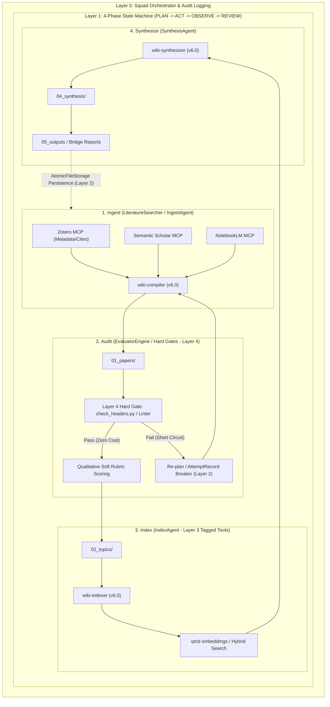

# Obsidian Agentic Research Vault Template

A boilerplate structure and toolset for running a structured Obsidian vault optimized for academic literature research and automated systems workflows. This template showcases a hardened **5-Layer Reference Agentic Architecture** for co-programming with agentic AI models (e.g. Google Antigravity, Claude Code, Gemini CLI).

## 🚀 5-Layer Reference Architecture

This repository contains the configuration, hooks, and custom skills implementing a deterministic, safe, and observable agentic pipeline:

1. **Layer 1: 4-Phase State Machine** (`PLAN` -> `ACT` -> `OBSERVE` -> `REVIEW`): Enforces step budgets and clear boundaries for LLM execution loops to prevent runaway token expenditure.
2. **Layer 2: Dual-Tier Memory + Action-Attempt Hash Register**: Implements a disk-backed key-value memory store and md5-based action deduplication to instantly break duplicate retry loops.
3. **Layer 3: Permission-Tagged Tool Registry**: Controls access to file operations and system execution tools.
4. **Layer 4: Hybrid Judge / Hard Gates**: Runs zero-token structural linting checks and python-based regex validations prior to sending code to qualitative LLM rubrics.
5. **Layer 5: Squad Orchestrator**: Dispatches specialized, instruction-restricted subagents for parallel execution of isolated subtasks.

---

## 📂 Vault Structure

```text
/vault
├── .agents/        # Workspace configurations, hooks (v8.0), and skills (v6.0)
│   ├── hooks.json  # Consolidated hooks configuration
│   ├── mcp_config.json # Dedicated MCP server definitions
│   └── skills/     # Specialized research agents (v6.0)
├── 01_papers/      # Literature notes (citekey, zotero_item_key required)
├── 02_topics/      # Conceptual and methodological notes
├── 03_raw/         # Immutable source inbox (GEMINI.md protected)
├── 04_synthesis/   # Cross-cutting summaries & Literature reviews
├── 05_outputs/     # Manuscripts, reports, Bridge Reports, and Reference Agent
│   └── reference_agent/ # 5-Layer Production-Grade Reference Architecture (v2.0.0-beta)
├── wiki/           # System infrastructure
│   ├── index.md    # Master vault index
│   ├── log.md      # Append-only operation log (@log.md)
│   └── system/     # System configurations and execution scripts
│       ├── hooks/  # Active lifecycle hook scripts (v8.0)
│       └── schemas/# Target folder validation schemas (v2.0)
└── assets/         # Templates, images, and PDF artifacts
```
---

## 🛠️ Getting Started

1. **Clone the repository** to your local machine in an Obsidian Vault.
2. **Environment Configuration**:
   * Rename `.env.example` to `.env`.
   * Fill in your API keys (`GEMINI_API_KEY`, `GITHUB_TOKEN`, `OBSIDIAN_API_KEY`).
3. **Configure MCP Servers**:
   * Inspect and customize `.agents/mcp_config.json` to configure connections to local Obsidian, Zotero, and Notion APIs.
4. **Run the Linter**:
   * Run the structural validator suite:
     ```bash
     python wiki_linter.py
     ```
---

## Lessons Learned & Architectural Retrospective

Building the v2.0.0-beta architecture and migrating from monolithic agent execution to a modular 5-Layer Production-Grade Reference Agentic Architecture (use documented in ARCHITECTURE_DECISIONS.md and tracked in wiki/log.md) provided several critical lessons:

1. Architectural Decisions & Why Monolithic Loops Fail

    - The Decision: Transitioned from an opaque, continuous prompt loop to an explicit 4-Phase State Machine (PLAN → ACT → OBSERVE → REVIEW).
    - The Lesson: When an LLM executes in a while-loop without explicit phase boundaries, failures during tool execution or synthesis cause the model to lose track of its trajectory. By enforcing discrete states and hard step budgets, every decision becomes inspectable, and runaway token consumption is eliminated.

2. Mistakes Made: Repetitive Action Loops & Token Waste

    - The Mistake: Early iterations of the active synthesis pipeline suffered from "looping behavior"—when a tool syntax error or missing parameter occurred, the model would repeatedly retry the exact same failing command, burning through API tokens and hitting context limits.
    - The Solution: I co-built an Action-Attempt Hash Register in Layer 2. By computing an MD5 hash of (toolName + JSON(args)), the system detects duplicate consecutive attempts and instantly short-circuits execution with a loop-breaker exception, forcing the agent to re-plan.

3. Permission Tagging & Safety Rails

    - The Decision: Every tool in ToolRegistry is explicitly tagged as READ_ONLY, MUTATING, or DESTRUCTIVE.
    - The Lesson: A flat tool list treats querying an ontology the same as deleting a file. By tagging tools at the registry level, our Layer 1 control loop intercepts destructive actions and requires explicit human verification before execution, safeguarding immutable source files in 03_raw/.

4. Why LLMs Cannot Grade Their Own Homework

    - The Mistake: Relying on the same LLM actor to evaluate whether a synthesized literature note was complete led to sycophantic agreement—the model would declare flaId or structurally incomplete notes "passed" to satisfy the prompt.
    - The Solution: I separated the Actor from the Judge by creating an independent EvaluatorEngine (Layer 4). Furthermore, I implemented Hard Gates (running deterministic Python linter scripts and header checks at zero token cost) before ever invoking qualitative Soft Rubrics. If a note fails structural linting, it is rejected before spending a single token on LLM grading.

5. Multi-Agent Squad Orchestration & Traceability

    - The Decision: Rather than passing 20 tools and massive instructions to a single generalist agent, I implemented a SquadOrchestrator (Layer 5) that dispatches specialized subagents (LiteratureSearcher, NoteCompiler, SynthesisAgent) with restricted tool authorization.
    - The Lesson: Tracing multi-agent execution requires hierarchical observability. I integrated an AuditLogger with trace-correlated IDs across all subagent invocations, making system debugging transparent and tractable. As tracked in wiki/log.md, this modular approach allowed us to perform batch remediations across 22 legacy notes with 100% precision while reducing total token consumption.

6. Other Learning Opportunities
   
  - Action: Standardized YAML frontmatter syntax to use block list formats (e.g.,  - tag ) instead of inline arrays ( [...] ).
  -  Best Practice: Never put raw wikilinks ( [[link]] ) inside YAML frontmatter fields as it corrupts Obsidian's properties parser.
  Always quote citekeys and item keys to preserve formatting.

  - Action: Created a  SquadOrchestrator  to split workloads into independent tasks and dispatch specialized, tool-restricted
  subagents (`LiteratureSearcher`, `NoteCompiler`, `SynthesisAgent`).
  -  Best Practice: Isolating execution contexts prevents context contamination and token exhaustion, while trace-correlated
  logging makes debugging transparent.

  -  Action: I created an independent `EvaluatorEngine` to review the synthesized notes.
  - Best Practice: Implement Hard Gates (zero-token structural checks, like Python regex linters) before qualitative soft rubrics.
  If a note is missing a mandatory header or contains unquoted wikilinks in properties, it is rejected instantly without spending
  LLM tokens on evaluation.

  - The Mistake: Early paper ingestions only imported a subset of Zotero annotations (often only 2-3 standard highlights) and
  frequently skipped abstracts, metadata, or methodological tags.
  -  Best Practice: Systematically resolved by establishing strict Rigor Standards, Verification Pipelines, and Quality Gates in vault guidelines (GEMINI.md)
  
      -  The Rule: Notes must map to paper-template.md.
      -  Instruction: The mandatory top-level sections ( ## Research questions ,  ## Methodology ,  ## Findings ,  ## Synthesis ,  ## Annotations ) must remain intact. Custom notes must be filed as H3 subheadings ( ### ) under the closest matching standard header rather than introducing random top-level layouts.
      - The Rule: The agent must cross-check any newly created note's YAML structure against the most recently validated compliant file—specifically designated as YYYY_[note_title].md . If metadata fields such as `aliases` or `study_design` are missing, the note is flagged as incomplete.

## Core Architecture: The 5-Layer Synthesis Loop

This version introduces a refined lifecycle powered by our **5-Layer Reference Agentic Architecture** (**Compile → Lint → Index → Synthesize**), ensuring that all research data transformations are deterministic, inspectable, and resilient against hallucination or token waste.




  

